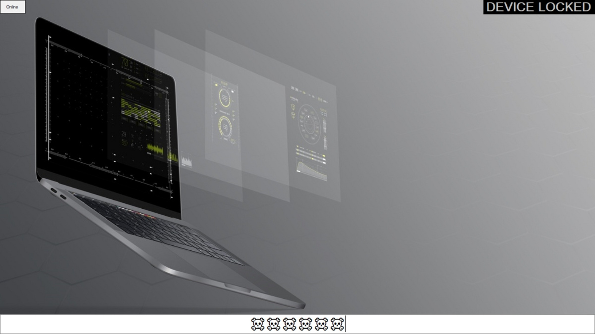

# LeyLocker
This was one of my beginner projects with Visual Basics.

## Description ✍️:
The purpose of this project was to remotely lock my personal device using a web panel. I have created till the password field and didn't get the chance to finish it then.

## Features ⚙️: 
| Features | Version 1 | Version 2 |
| -------- | :-----------: | :-----------: |
| Password Protection | ☑️ | ☑️ |
| Task Manager Blocker | ☑️ | ☑️ |
| UAC Elevation | ☑️ | ☑️ |
| Always Focused Mode | ☑️ | ☑️ |
| Self Destruct | ☑️ | ☑️ |
| MySQL Connection | ❌ | ☑️ |
| Remote Control | ❌ | ☑️ |
| Auto Startup | ❌ | ☑️ |
| Mouse Access Blocker | ❌ | ☑️ |
| Keyboard Access Blocker | ❌ | ☑️ |
| Web Panel | ❌ | ☑️ |
| Disable Keypress (Ctrl, Shift, X) | ❌ | ☑️ |

## Creation Date ⏲️:
- 29/09/2018
